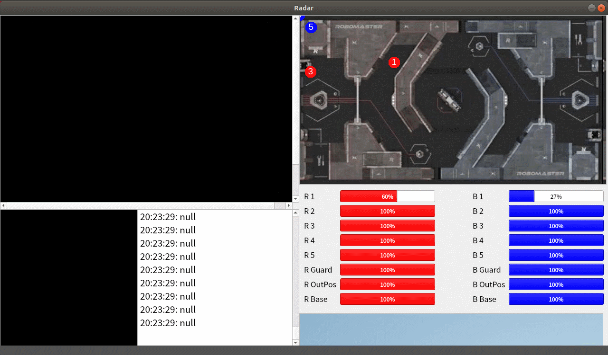

### 常州大学Robomaster-Climber战队

#### armoredPlate(2023传统视觉装甲板识别)

###### src文件夹

​    存放源代码
​    每个功能需要单独定义在一个,cpp和,h文件里
​    所有的宏定义在一个.h文件

###### lib文件夹

​    后续调用的库都放在此文件夹下
​    同理，需要README.md介绍

###### docs文件夹

   存放文档的文件夹

###### asset文件夹

​	存放资源的文件夹，可用于存放图片，深度的训练结果等

#### Radar(2024雷达UI)

###### 框架

Qt6.1,Ubuntu18.04,camke构建

###### 效果

